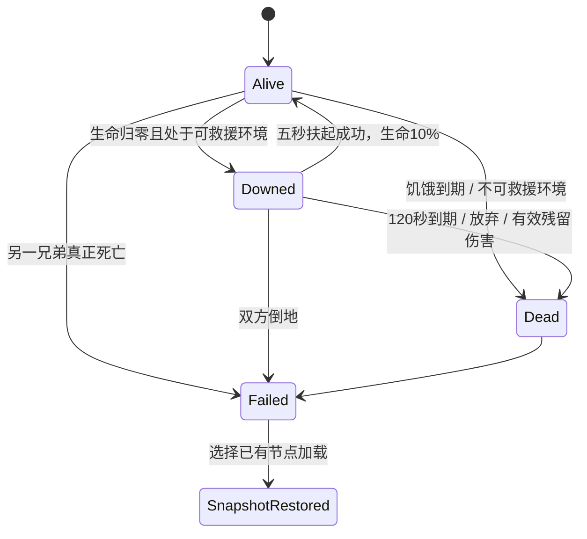

# DSGN-R04｜生存恢复、倒地救援与环境伤害

状态：**APPROVED（D1—D6产品规则范围）**。2026-09-26。任务：[TASK-044](../tasks/TASK-044.md)，对应原稿TASK-046。Owner／Reviewer：XLingyyy。Owner于本轮明确：“044的设计我已经确认可以采纳，开始施工044任务”。D1—D6产品方案全部采纳；与原GDD冲突处以本文件获批规则为准。工程字段／迁移仍待具体实现协调，未配表部分和运行验证不因设计批准而完成。

## 1. 来源与现状

- [GDD机械提取](archive/gdd-v0.3-source.md)：生命与饱食章节Q061—063、Q161—170；耐力Q171—178；伙伴Q251；倒地／回档Q131—145、Q259—265。
- [043已批准规则](DSGN-R01-world-time-persistence.md)：A有效实玩秒、W游戏分钟；睡眠W+480且A不增；危险入口限制、传送倒地弟弟不复活、严重饥饿期限按W、同档恢复。044不得恢复旧“睡眠不推进日期”。
- 2026-09-24审计指出正式用药、严重饥饿、倒地互救和环境伤害尚未完成。043父基线b7d4df3的源码核对如下，未引入052分支。

| 已读实现 | 已确认事实 | 本单不能据此判定 |
|---|---|---|
| `HearthwardGameplayComponent.cpp::UseItem` | 即时扣1件药、直接加血 | 3秒用药、持续药、受伤损耗已实现 |
| 同文件`TickComponent` | 跑动提高饱食消耗；正饱食自然回血；零饱食降至10% | 高活动复合倍率、严重饥饿三日死亡、正式双方互救已有答案 |
| `HearthwardFurnitureInteractionComponent.cpp` | 床5秒扣10饱食、加30血及回耐 | 正式睡眠或治疗区收费规则 |
| `HearthwardTimedActionState.h` | 当前共用5秒动作状态 | 可以直接用于3秒药品、不必协调接口 |
| SaveGame／SaveSubsystem、043契约 | 已有安全保存、快照和时间线失效机制 | 正式生存状态／残伤／救援已经完整持久化 |

## 2. 原GDD已定规则与历史缺口（冲突以获批D1—D6为准）

| 项目 | 规则 |
|---|---|
| 基础状态 | 兄弟生命、耐力、饱食初始均100；成长后的最大值与当前值区分 |
| 饱食 | 满条普通活动48实玩分钟；高活动冲刺／游泳／战斗各为2倍，复合方式未定；食物20／40／60梯度 |
| 饥饿 | 零饱食从满血降至10%最大生命约5实玩分钟；已低于10%不补血；严重饥饿后3游戏日死亡，进食至至少10饱食才解除并重置期限 |
| 自然恢复 | 战斗／非战斗／休息每实玩秒分别为最大生命0.1%／0.5%／2%；扶起后可自然回血；治疗区快于床铺 |
| 用药 | 3实玩秒；速效、持续两种方向；持续药重复只刷新时长、不叠加；受伤中断并损失部分材料 |
| 耐力 | 停止消耗后延迟0.5秒；初始行走／举盾空耐回满约12／20秒，是否含延迟未定；游泳不回耐，悬浮只保留已有耐力 |
| 倒地 | 生命耗尽，120实玩秒待救；可以立即放弃；5秒扶起到10%最大生命，无必需救助药品，移动或受伤中断并重新开始 |
| 失败 | 双方倒地立即失败；任一真正死亡必须读档；无扣钱复活、免死或长期疗养 |
| 敌方 | 不主动补刀倒地兄弟；敌人击晕等效击杀已经由043批准，不能套用兄弟待救状态 |
| 水下 | 耐力耗尽下沉，10实玩秒溺水窗口；零耐力不能无限悬浮 |
| 伙伴 | 自身饱食低于25%自动食物；生命低于35%在适合时机用药；倒地剩余不足30秒提高救助优先级 |
| 存档 | 战斗、追击、兄弟倒地、溺水、坠落或弟弟危险禁存；严重饥饿可存；危险自动档延后；加载不重置未来计时 |

## 3. D1 已批准：饱食、回血与三日期限（R04／R08）

**已批准统一到最大生命上限，不再采用饱食分档治疗上限。** 本轮批准解决了GDD中“药品受饱食上限”与“都能回满”的冲突。

1. 饱食大于0且未倒地时，自然恢复可到最大生命；战斗、非战斗、休息三种速率互斥，先取战斗，再取有效休息，最后取非战斗，不相加。
2. 饱食为0时停自然回血，药品仍有效且可到最大生命；饥饿扣血继续，治疗不解除严重饥饿、不重置三日。倒地者既不自然回血，也不能靠普通药直接起身。
3. 高活动取一个2倍倍率，冲刺、游泳和战斗重叠仍为2倍。正常饱食消耗 `100/2880 × ΔW`；高活动乘2。跳时采用基础倍率，遵循043不自动吃饭／喝药。
4. 零饱食扣血归W：每游戏分钟扣最大生命的0.3%，扣到10%停止；外伤已低于10%时不回补。300游戏分钟从100%到10%，对应正常运行5实玩分钟。跳时中的扣血同样结算，不因A冻结而免除饥饿后果。该时钟归属是本次已批准的衔接规则。
5. 饱食为0且生命到达或低于10%时，首次进入严重饥饿，记录 `starvation_due = W + 4320`。治疗把生命抬高不改due。饱食变成1—9可停止零饱食扣血，但严重饥饿标记与due仍保留；达到10才清除。之后重新满足严重饥饿条件，创建新期限。
6. 已批准严重饥饿减益：移速−20%、伤害−25%、兄弟生产效率−30%，只应用一次，不影响普通族人；保留暗角、视距缩短、视角收窄方向，视觉强度交实际051（原稿053）可读性配置，本单不宣称视觉签收。
7. 达到due即真正死亡；不能通过治疗、休息、传送、读档或不足10的进食续期。睡眠／篝火允许严重饥饿者请求，但在失败事件时间停止，先前已发生的合法世界结算保留。

**纸面算例：** 饱食100睡8小时，基础消耗480×100/2880≈16.667，剩83.333。饱食0、生命100在W=0睡8小时：W=300到10%并进入严重饥饿，due=4620；W=480醒来仍10%，剩4140游戏分钟，A不增加。这个例子不代表已运行游戏测试。

## 4. D2 已批准：药品与治疗设施（R04／R08／R14协作）

| 项目 | 采用候选 |
|---|---|
| 速效药 | 读条完成恢复使用时最大生命的30%，最多当前最大生命 |
| 持续药 | 读条完成后15个有效实玩秒累计恢复使用时最大生命的50%；仅一个持续槽 |
| 同类持续药 | 同强度成功使用刷新为完整15秒；不立即补发剩余治疗、不叠加多条流。低强度覆盖高强度请求拒绝且不扣药；高强度可替换，旧剩余治疗作废，无返还 |
| 用药姿态 | 站定3秒；允许转镜头；移动、攻击、跳跃、主动取消或成功传送中断。暂停冻结读条，不算中断 |
| 正常费用 | 开始时锁定本人背包的一份药量，完成时扣除并提交疗效；满血、倒地、权限不足、药量不足在开始前拒绝 |
| 受伤损失 | 采用每次实际伤害中断损失完整一份药的50%药量，最多扣当前剩余量；零实际伤害格挡不触发 |
| 非受伤中断 | 不产生疗效，释放锁定药量，费用为0；同帧既受伤又主动取消按受伤结算一次，不能免费规避损失 |
| 半份余药 | 保留半份，可独立使用；速效回复15%，持续药15秒共25%。半份再次被伤害打断则耗尽。重量按药量计；不凭空退原材料。完整／半份语义需要R14与库存／存档契约协调，不能实现成吞掉整份药 |
| 治疗区 | 采用安全状态驻留时每A秒恢复最大生命3%，替代床的2%，无额外金币／材料收费；仍正常消耗饱食。离开或进入战斗立刻失去该速率；药品制作照真实配方付费 |

30%、50%／15秒以及减益数值在旧提问中未获批；本轮Owner采纳D1—D6后正式生效，批准日期为2026-09-26，不追认此前审批。配方、稀有药种类、高级药量留给实际046内容表；无配置时不生成该药。

用药完成时若已满血：采用取消此次提交并释放药量，不制造超额治疗或“预存回血”。若角色已死亡／倒地，失效；受伤导致倒地的同一次事件仍只结算一次受伤损失。持续药起效后受伤不会额外损失药品；倒地时取消未完治疗，扶起不恢复旧疗程。睡眠／篝火不推进持续药的A剩余时间，保留到醒后继续；严重饥饿期限继续依W推进。

## 5. D3 已批准：恢复时钟与暂停（R09）

- 采用12／20秒是恢复阶段本身，另加0.5秒延迟；初始实际空耐到满为12.5／20.5秒。按当前最大耐力比例恢复：普通每A秒 `Smax/12`，举盾 `Smax/20`；冲刺消耗 `0.8×Smax/12`，冲刺时不回耐。等级提高后保持无修正的回满时长；技能和负重按各自正式表修正。
- 攻击、跳跃、冲刺等真实消耗重置0.5秒延迟；一直游泳不能积攒恢复，停止划水仅保持剩余耐力；上岸后按0.5秒延迟恢复。
- 实际暂停冻结A、W、药品、救援、倒地、溺水、持续伤害和全部恢复。菜单开启不自动取消短动作。
- 采用普通页面服从“打开界面暂停”设置；关闭时背包／地图等持续运行。伙伴对话继续沿当前Demo不暂停，明确展示世界未暂停；Esc真正暂停冻结所有系统。该方案放弃GDD的“默认所有界面暂停”在伙伴页上的默认值，已由Owner本轮采纳；批准来源为明确确认，不从现有Demo反推。
- 保存／读档／失败确认采用真正暂停；死亡事件不能被随后打开对话或暂停撤销。设置改变只在稳定边界生效，不清除已发生伤害。

## 6. D4 已批准：倒地、救援与环境伤害（R18／R22）

生命主状态与用药／扶起动作分开；用药中不等于免受伤害。

- Downed开始即显示剩余120A秒及放弃入口；读条、暂停或重新接近均不延长due。未倒地同伴才能扶起，持续5A秒，需位于可交互位置且有可达落点；距离2米并通过遮挡检查，不能隔墙远程施救。
- 倒地者不能移动、用药或作为救援者；扶起者移动、受伤、攻击、跳跃，目标失效或距离超出2米均中断；重试从0秒，无药品／材料费用。另一人被击倒即双方倒地失败。
- 采用掉到地面、普通武器致零等可救援情况先Downed；10秒溺水耗尽、死亡体积／无可站立落点深渊属于不可救援，直接Dead。普通坠落按正式伤害表计算，致零但落点可救则Downed；坠落安全高度与伤害曲线由实际051通行验收／后续配置提供，缺表不能把一切坠落变成秒杀。
- 采用倒地后的任一**新的有效正伤害事件**直接Dead：飞行中投射物、爆炸、火焰、陷阱及落地伤害均如此；敌人不主动重新选择倒地者。最初使人倒地的同一hit_id不可重复作为补刀，持续伤害下一次独立tick可致死。格挡到0、重复回调、仅有特效接触不致死。不额外给予倒地无敌期。
- 未耗尽的溺水10秒窗口内到达可呼吸且可站立岸边才能退出溺水；仅短暂出水但仍零耐力且无法支撑不重新获得一轮10秒。救助不允许在无法持续呼吸的位置站定读条；不新增水下瞬移救援。
- 任何一人真正死亡或双方倒地，结束当前进程操作，提供现有可用节点；不恢复另一人的状态以继续玩、不自动创建“复活档”。

## 7. D5 已批准：弟弟自动维持与救助权限（R18）

1. 沿用低于25%饱食／35%生命阈值，采用首版固定不开放玩家编辑。仅使用本人背包，不能远程扣玩家背包或仓库。
2. 采用普通食物按足以恢复到至少25且浪费最小选择；不足时选当前能获得最高饱食的一份。没有食物则显示缺少物资，不凭空补充、不因失败每帧重复请求。饱食达到10即可解除严重饥饿，即使尚未达自动进食目标25。
3. 普通药优先速效；缺少速效时才用持续药；已有持续药且剩余治疗足以达到35%时不再次用药。半份也按真实疗效判断。无可用药则寻找安全位置并反馈缺药，不锁死移动，也不自动申请生成药物。
4. 稀有／唯一药默认禁自动消耗，须玩家对指定物品显式授权；授权随档恢复，可撤销，完成扣药前再核验。撤销触发非受伤取消，已实际消耗不追回；口头提及药名不等于授权。
5. 救援先确认真实位置、路径、交互可达性和未来5秒明显危险；可达则中止当前生产／采集动作去救助，保留已持有物资，不给未完成劳动补产出。采用禁止为救援主动穿过已知必死环境；剩余不足30秒提高优先级也不瞬移或无敌。
6. 采用同时存在自救和救兄长时：立即致死环境先撤离；否则若到达＋5秒救援仍能赶上，优先救援。若自身低血且该位置无法完成读条，先利用掩体／普通速效药创造机会；不能在剩余时间不足时无限重复三秒用药。不可达或窗口不足给出真实原因，玩家倒地界面仍可放弃。
7. 救援判断由UE真实状态执行；模型可表达意图，不提供生命、剩余时间、药品权限或安全事实。超过30米不提供隔空完整报告；倒地HUD允许显示客观救援失败原因，不冒充弟弟实时讲话。

## 8. D6 已批准：同时间事件与保存／旅行（R22）

采用同一逻辑时间边界按下列顺序：

1. 完成截至此时的连续消耗／已有药效积分，收集同时间的伤害与期限事件，不提前发完成奖励。
2. 对已在该时间点到期的严重饥饿／倒地／溺水期限及即时环境致死先结算；记录hit_id并拒绝重复伤害。已发生伤害造成的用药损失只提交一次。
3. 派生Downed／Dead及双方失败；已失败时拒绝随后到达的扶起、药效提交、进食、传送和保存。
4. 对仍有效的用药／扶起／进食完成做原子提交。同时间“最后一秒吃饭”或“120秒整扶起”不优先于到期；界面必须显示此边界，不能按帧率偶然改变生死。
5. 按043执行传送：活且能操作站点的玩家才可发起；交战倒地弟弟随行但保留倒地剩余时间；非交战弟弟不瞬移。采用正在溺水、坠落或站点不可站立时拒绝旅行，地面战斗本身仍允许已批准旅行。落点失败不移动、不回血、不取消原动作；成功才中断动作，并按D2的受伤／非受伤原因收费。
6. 重判安全再保存。严重饥饿仍允许，记录原due并显示剩余期限；危险延后的自动档仅留一个待办，到安全稳定边界保存一次。快照不可截在扣半份药与中断状态之间。

加载先停输入和旧异步写入，再恢复兄弟状态、A/W、药量／疗程、原饥饿due、伤害去重／危险状态与权限；生成新epoch，最后重建交互。禁止从本机离线时间推算存活、回血或产出。安全保存本就禁止倒地，所以常规新档不得合法包含Downed；测试夹具／迁移不得绕过此限制。读档不是“重新给三天”。

## 9. 可复核边界案例（纸面推演，运行均NOT_RUN）

| ID | 输入 | 已批准预期 |
|---|---|---|
| SV01 | 饱食10、生命50／100，非战斗100A秒，无其他消耗倍率 | 可到满血；没有75%／30%隐藏上限 |
| SV02 | 饱食0、生命100，300W分钟 | 生命10；进入严重饥饿due=当前W+4320 |
| SV03 | 饱食0、生命5首次进入，随后治疗至35 | 不回补至10；保持第一次due，不因治疗重置 |
| SV04 | 严重饥饿中进食至9，再进食至10 | 9仍保留due；10清除严重饥饿及due |
| SV05 | 满饱食睡480W；同时有持续药剩10A秒 | 饱食约83.333，药仍剩10A秒；不补发治疗 |
| SV06 | 严重饥饿due=W+120，请求睡480W | 在W+120失败，后360分钟不结算 |
| SV07 | 完整速效药第2A秒受伤；重复伤害回调 | 取消疗效、剩半份，只扣一次；再次成功使用回复15% |
| SV08 | 半份药再次受伤中断／主动取消 | 前者耗尽半份，后者保留半份；均无治疗 |
| SV09 | 同强度持续药剩3秒，成功再用；低强度再覆盖 | 前者只得到新15秒单流，无旧余量补发；后者拒绝不扣药 |
| SV10 | 空耐力、最大耐力100／200，无修正普通行走 | 均12.5A秒到满，0.5秒为延迟 |
| SV11 | 单人倒地后立即放弃；双方同边界倒地 | 前者可立即回档；后者立即失败，无强制等120秒 |
| SV12 | 倒地剩4秒开始5秒扶起；剩5秒整开始扶起 | 均因期限优先不能救活；不能用开始读条冻结窗口 |
| SV13 | 扶起完成前受伤／移动，后再试 | 中断后0进度，倒地due不变，无材料损耗 |
| SV14 | 同一hit使人倒地后重复上报；下一独立火焰tick | 重复hit忽略；新正伤害导致Dead，不主动补刀规则不等于无敌 |
| SV15 | 溺水剩0.1秒短暂出水但零耐力无支撑；到岸 | 前者不续10秒；到岸满足呼吸与支撑才退出 |
| SV16 | 战斗站点传送，弟弟倒地剩25秒；目标落点失败 | 成功才随行且仍剩25秒；落点失败全体保持原状态 |
| SV17 | 弟弟有普通半药和未授权稀有药，生命20% | 只能选择普通半药；不能为优化疗效擅用稀有药 |
| SV18 | 倒地剩20秒但路径不可达 | 不瞬移、不隔空扶起；反馈失败原因并保留放弃入口 |
| SV19 | 严重饥饿保存剩200W，未来治疗／吃饭后读回 | 恢复原生命饱食和200W期限，无未来治疗／解除记录 |
| SV20 | 同帧受伤、取消药、请求保存 | 只提交一次损失；保存读取结算后安全状态，危险则延后 |
| SV21 | 真正暂停／普通不暂停页面／伙伴对话 | 真暂停全冻结；后两者继续世界模拟，不悄悄冻结倒地或溺水 |
| SV22 | 保存后授权稀有药并发模型命令，再回旧档 | 旧档权限恢复；旧epoch回复不扣药、不救人、不补奖励 |

## 10. Owner已批准范围与后续归属

| 决定 | 本轮已确认内容 | 获准子范围 |
|---|---|---|
| D1 | 正饱食可自然回满；零饱食停自然回血但可用药；饥饿扣血按W、严重饥饿进入条件／due、复合2倍与三项减益 | R04／R08获准子范围 |
| D2 | 30%速效、50%／15秒持续、站定3秒；受伤损半份／取消不扣、余药按比例；治疗区3%且无额外收费 | R08；R14药量表示仍须工程协调 |
| D3 | 12／20秒另加0.5秒、按最大耐力比例；伙伴对话不暂停的默认例外 | R09获准子范围 |
| D4 | 2米无遮挡救援；新的有效倒地残伤致死；溺水退出条件／不可救环境区分 | R22／R18获准子范围 |
| D5 | 固定自动食药阈值、普通药优先、稀有逐物授权、救援安全与自救优先序 | R18获准子范围 |
| D6 | 到期／伤害优先于同刻治疗与扶起；环境危险拒绝旅行；稳定边界保存／旧epoch失效 | R22获准子范围 |

D1—D6于2026-09-26全部获Owner采纳。R项仅登记对应获准子范围：R04的核心冲突已解决；R08／R09／R18／R22及跨项配表、环境与物品实例仍有后续细节，整条保留OPEN。本文件不等于代码或运行验收。任务执行顺序遵循用户确认，不由设计批准自动跳号。
